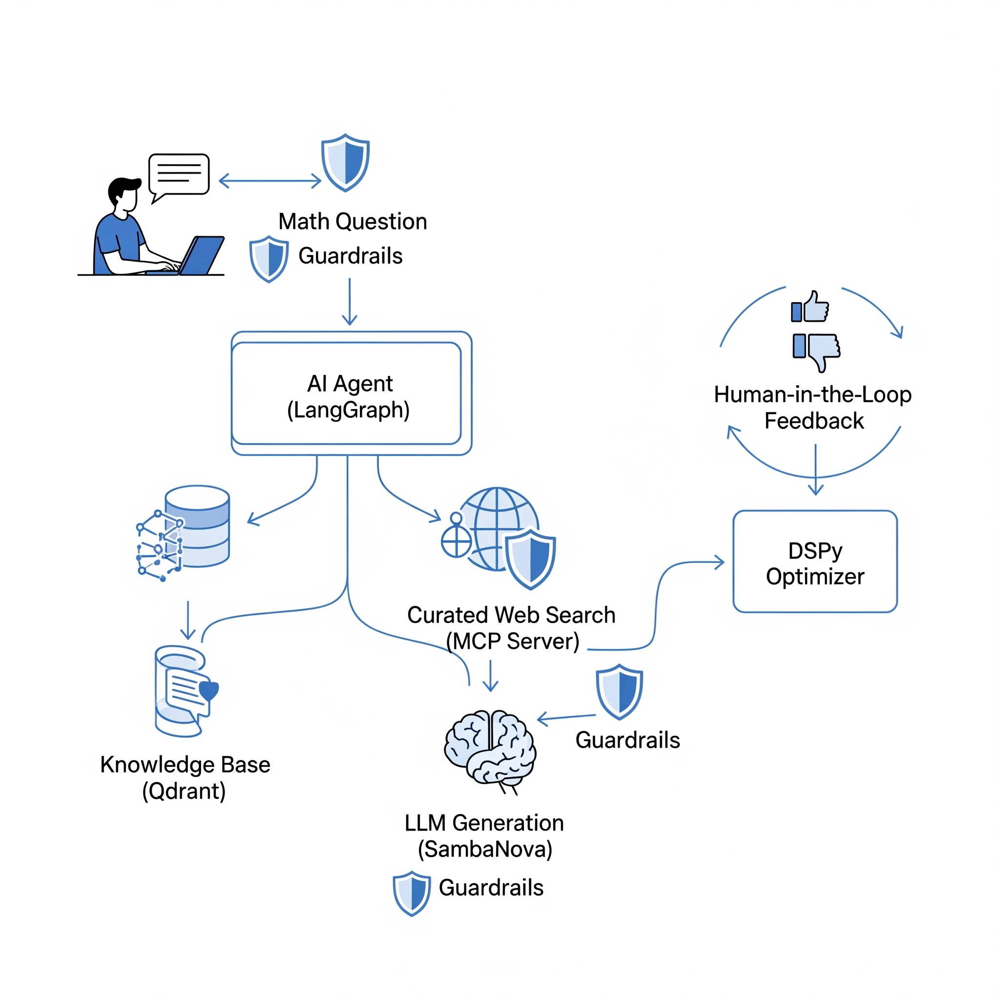
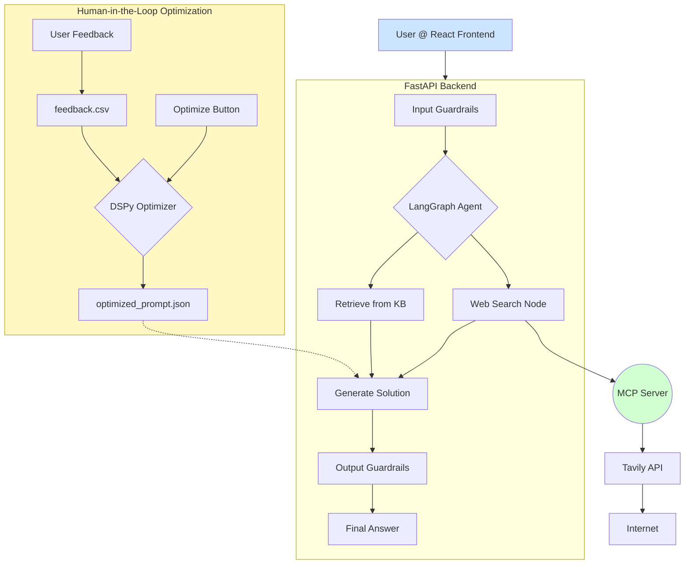

# 🧠 AI Math Tutor

**An Agentic-RAG System with Self-Improvement**

An advanced AI Math Tutor powered by a Retrieval-Augmented Generation (RAG) architecture. It features intelligent agent routing, feedback-driven self-improvement, and dynamic knowledge base construction for solving mathematical problems effectively.

---

## 🚀 System Overview

<p align="center">
  
</p>

---

## ✨ Key Features

* **Agentic Routing:** Core agent, powered by **LangGraph**, decides whether to use internal knowledge or perform a curated web search.
* **Hybrid Knowledge Base:** Fast and accurate retrieval from curated datasets (e.g., `gsm8k`) via **Qdrant** with hybrid search.
* **Custom KB Creation:** Upload PDFs or provide a URL to dynamically create personalized knowledge bases.
* **Secure Curated Web Search:** Queries pass through a **Model-Controlled Procedure (MCP)** server with strict domain whitelisting (e.g., *Khan Academy*, *WolframAlpha*).
* **Privacy-First Guardrails:** All user input is filtered for PII using **Presidio** before LLM processing.
* **Human-in-the-Loop Learning:** Corrections by users are logged and used to automatically optimize prompting logic via **DSPy**.
* **Modern Web Stack:** FastAPI backend, React frontend, responsive UI via **React-Bootstrap**.

---

## 🏩 System Architecture



---

## 🛠️ Technology Stack

| Component      | Tools/Libraries                          |
| -------------- | ---------------------------------------- |
| **Backend**    | Python, FastAPI, LangGraph, DSPy, Qdrant |
| **Frontend**   | React, React-Bootstrap, Bootstrap        |
| **AI/LLMs**    | SambaNova, Hugging Face Datasets         |
| **Search**     | Tavily API, MCP Server                   |
| **Guardrails** | Presidio (PII), Detoxify (Toxicity)      |
| **Monitoring** | Opik Tracer                              |

---

## ⚙️ Setup and Installation

### 1. Prerequisites

* Python 3.10+
* Node.js 18+ and npm
* API keys for:

  * SambaNova
  * Tavily
  * Opik

---

### 2. Backend Setup

```bash
cd backend

# Install Python dependencies
pip install -r requirements.txt

# Download PII model
python -m spacy download en_core_web_lg
```

Create a `.env` file in `backend/` with the following:

```env
SAMBANOVA_API_KEY="your-sambanova-key"
TAVILY_API_KEY="your-tavily-key"
OPIK_API_KEY="your-opik-key"
OPIK_WORKSPACE="your-opik-workspace"
```

---

### 3. Frontend Setup

```bash
cd frontend
npm install
```

---

## ▶️ Running the Application

### Terminal 1: Start the MCP Server

```bash
cd backend
python mcp_server.py
# Default: http://localhost:8000
```

### Terminal 2: Start the FastAPI Application

```bash
cd backend
uvicorn app.main:app --reload --port 8001
# API: http://localhost:8001
```

### Terminal 3: Start the React Frontend

```bash
cd frontend
npm start
# Frontend: http://localhost:3000
```

---

## 📖 Usage Guide

### 1. Creating a Knowledge Base

* Open the sidebar.
* Enter a name for the new knowledge base.
* Upload a local PDF or provide a public URL.
* Click **Create KB**.
* The KB will appear in the "Active Knowledge Base" dropdown once created.

### 2. Asking a Math Question

* Select the desired KB.
* Enter your math problem in the input box.
* Submit to receive an answer.

### 3. Human-in-the-Loop Optimization

* If the agent's answer is incorrect, click **👎**.
* Submit the correct step-by-step solution.
* Click **Optimize with Feedback** after feedback is collected.
* **Restart the FastAPI server** to apply the new prompt logic.

---

## ✅ Example Knowledge Bases

* `gsm8k-base`
* `math500-base`
  These are initialized on first use.

---

## 🔒 Security & Guardrails

* **PII Redaction:** Powered by **Presidio**
* **Toxicity Detection:** Powered by **Detoxify**
* **Curated Domains:** All web access restricted via **MCP**

---

## 📊 Observability

* Integrated with **Opik Tracer** for tracing and performance monitoring.

---
